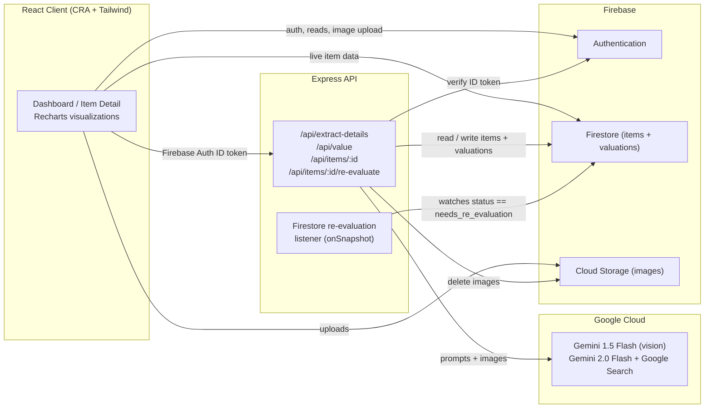

[](https://github.com/mahesh-dilip/omni/actions/workflows/ci.yml)

# Omni

**Snap a photo of an item and Omni uses Google Gemini to identify it, appraise its market value, and track that value over time — a visual, AI-powered inventory of your stuff.**

Omni is a full-stack web app for cataloguing physical possessions and keeping an eye on what they're worth. You upload a photo; a multimodal Gemini model identifies the object, picks a category, and proposes the valuation attributes that matter for that category (e.g. condition, year, storage size). After you confirm or edit those details, a second Gemini model — grounded with Google Search — estimates the item's current resale value and explains its reasoning. Each valuation is saved to a per-item history, so you can re-evaluate later and watch the value move on a line chart. A dashboard rolls everything up into a portfolio view: total estimated value, item counts, and a category breakdown pie chart.

> **Note:** Valuations are AI-generated estimates from a language model with web search, not certified appraisals.

## Architecture



## How it works

1. **Auth** — Users sign up / sign in with Firebase Authentication (email + password). The React app guards routes (`/`, `/item/:id`) and redirects to `/login` when signed out.
2. **Upload & smart extraction** — On the Dashboard, uploading an image base64-encodes it and POSTs it to **`/api/extract-details`**. The Express backend sends it to **Gemini 1.5 Flash** (vision) with a prompt that returns JSON: a name, description, best-fit category, and a dynamic set of valuation attributes (always including `Condition`), pre-filled with any values Gemini can read off the image.
3. **Confirm** — The user reviews/edits the name, category, description, and attributes. The image is uploaded to Firebase Cloud Storage and an item document is written to Firestore (`status: processing_valuation`).
4. **Valuation** — The app then calls **`/api/value`**, where **Gemini 2.0 Flash** with the **Google Search** tool finds a current estimated market value and returns `{ is_trackable, estimated_value, currency, reasoning }`. The backend batch-writes the result to the item and appends a record to its `valuations` subcollection.
5. **Item detail & history** — `/item/:id` shows the item, its attributes, and a **Recharts line chart** of valuation history. Users can edit details (**`PUT /api/items/:id`**), trigger a re-valuation (**`POST /api/items/:id/re-evaluate`**), or delete the item (**`DELETE /api/items/:id`**, which also removes the Storage image).
6. **Background re-evaluation** — The server also runs a Firestore `onSnapshot` listener: setting an item's `status` to `needs_re_evaluation` triggers a server-side re-appraisal (with retry logic) without an explicit API call.
7. **Portfolio dashboard** — Live Firestore subscriptions feed summary cards (total value, item count, most valuable item) and a category-breakdown pie chart.

All write/mutate endpoints require a Firebase ID token (`Authorization: Bearer <token>`), verified server-side with the Firebase Admin SDK, and enforce per-user ownership before mutating an item.

## Tech stack

| Layer | Technology |
|-------|-----------|
| Frontend | React 18 (Create React App), React Router 7, Tailwind CSS, Recharts, lucide-react |
| Backend | Node.js, Express 5, Firebase Admin SDK |
| AI | Google Generative AI SDK — Gemini 1.5 Flash (vision) + Gemini 2.0 Flash with Google Search grounding |
| Data & infra | Firebase Authentication, Cloud Firestore, Firebase Cloud Storage |

## Local setup

### Prerequisites
- Node.js 18+
- A Firebase project with Authentication (Email/Password), Firestore, and Storage enabled
- A Google Gemini API key ([aistudio.google.com](https://aistudio.google.com/app/apikey))
- A Firebase service account key JSON (Firebase console → Project settings → Service accounts → Generate new private key)

### Backend
```bash
cd backend
npm install
cp .env.example .env          # add your GEMINI_API_KEY
# place your service account JSON at backend/serviceAccountKey.json (git-ignored)
npm start                     # serves http://localhost:3001
```

### Frontend
```bash
cd frontend
npm install
cp .env.example .env          # add your Firebase web config + REACT_APP_API_URL
npm start                     # serves http://localhost:3000
```

To create a production build:
```bash
cd frontend
npm run build                 # output in frontend/build/
```

> **Secrets:** `backend/serviceAccountKey.json` and all `.env` files are git-ignored. The Firebase **web** config values (in `frontend/.env`) are public client identifiers protected by Firebase Security Rules (`storage.rules` and your Firestore rules) — they are not secret. The Gemini API key and the service account JSON **are** secret and must never be committed.

## Screenshots

<!-- SCREENSHOTS -->
